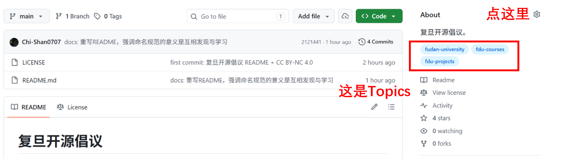

# 复旦开源倡议：GitHub 仓库命名与 Topics 约定

  <strong>让复旦同学的课程资料、学习笔记和学生项目，更容易被发现。</strong>

  <a href="https://github.com/topics/fudan-university">fudan-university</a> ·
  <a href="https://github.com/topics/fdu-courses">fdu-courses</a> ·
  <a href="https://github.com/topics/fdu-projects">fdu-projects</a>

> 一个人开源，是一座孤岛。
> 一群人开源，是一片生态。

## 为什么会有这个倡议？

在复旦，已经有很多同学在 GitHub 上开源自己的课程笔记、实验代码、复习资料、项目 Demo、工具和研究原型。

这些内容本来很有价值，但它们常常散落在不同的账号、不同的仓库名、不同的标签下面。
你可能写过一份很好的课程笔记，却很难被后来的同学找到；你可能做过一个有趣的项目，却只停留在自己的主页里。

这不是因为大家不愿意分享，而是因为我们缺少一个共同的入口。

所以这个倡议只做一件很小的事：

**约定一套统一的 GitHub 仓库命名方式和 Topics 使用规范。**

它不建立中心化平台，不收录仓库列表，不做内容审核，也不要求任何人申请加入。
只要你愿意按照这个约定命名仓库、添加 Topics，你的仓库就自然成为复旦开源生态的一部分。

**不是为了管理，是为了让彼此看见。**

## 命名规范

### 课程类

topic: [`fdu-courses`](https://github.com/topics/fdu-courses)

格式：`fdu-course-<课程英文名>-<学期>`

- 课程英文名：教务系统官方英文名称，空格替换为 `-`，统一小写
- 学期：`xxspring` / `xxfall`（如 `25fall`、`26spring`）

示例：
- `fdu-course-algorithms-25fall`
- `fdu-course-machine-learning-26spring`

### 项目类

topic: [`fdu-projects`](https://github.com/topics/fdu-projects)

格式：`fdu-project-<项目名>`

示例：
- `fdu-project-robot-manipulation`
- `fdu-project-llm-wiki`

### 通用 topic（可选）

任何与复旦相关的仓库，都建议再打上 [`fudan-university`](https://github.com/topics/fudan-university)，让全校同学都能从一个入口发现你。

## 什么是 topics，怎么设置

topics 不是文件夹，不是标签分支，不是提交信息——它是仓库的**分类标签**，显示在仓库主页的 About 区域。别人搜索某个 topic 时，所有打了这个标签的仓库都会出现。

设置方法：打开你的仓库主页 → 右侧 About 栏右侧的齿轮图标 → 在 Topics 输入框中添加对应的 topic。

## 如何参与

1. 按规范命名你的仓库
2. 给仓库打上对应 topic（课程类加 `fdu-courses`，项目类加 `fdu-projects`）

就这样。没有门槛，没有审核，按规范命名、打好 topic，你就是倡议的一部分。

## 许可证

本项目采用 [Creative Commons Attribution-NonCommercial 4.0 International (CC BY-NC 4.0)](https://creativecommons.org/licenses/by-nc/4.0/) 许可证。

- **署名** — 您必须给出适当的署名，提供指向本许可证的链接，并标明是否进行了更改
- **非商业性** — 您不得将本材料用于商业目的
